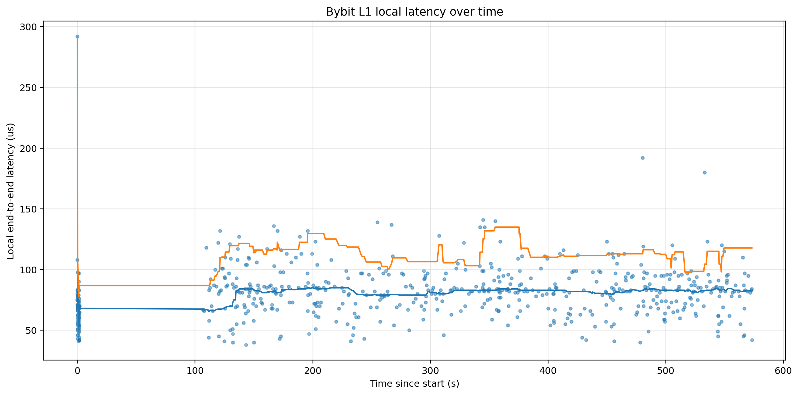
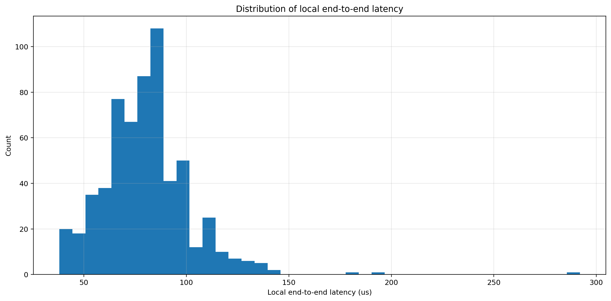
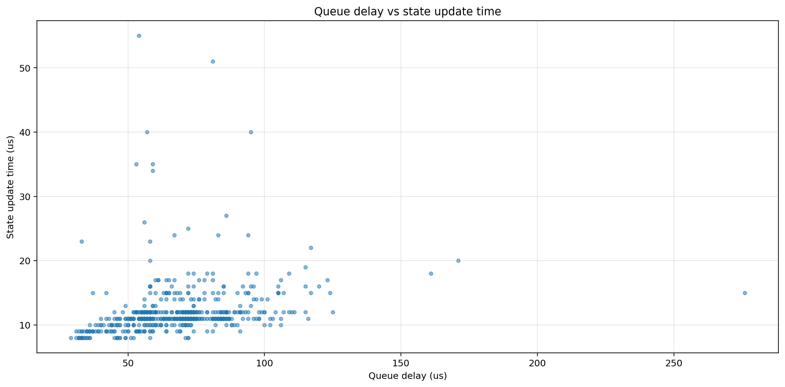
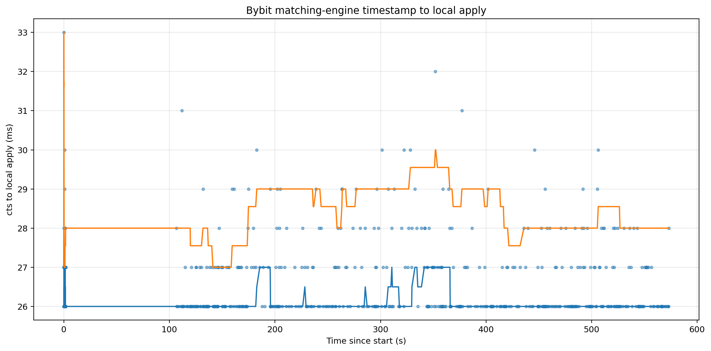
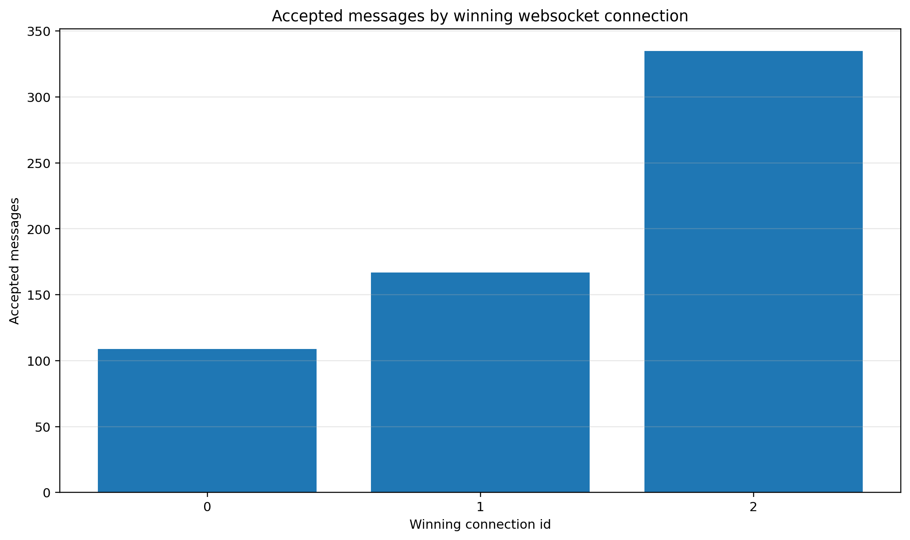

# HFT_Sample

A clean-room sample repository showcasing market-data ingestion, state building, and market-making research implementations. This repo is intentionally NDA-safe and focuses on clarity and reproducibility over breadth.

## Current Status (Implemented)

### Bybit (Python)

**Located in:** `Bybit/`

#### What's included

- WebSocket market-data ingest for:
  - `orderbook.1.<symbol>` (top-of-book stream)
  - `orderbook.50.<symbol>` (snapshot + delta)
- Opens 3 WebSocket connections to the same topic (staggered) to reduce latency spikes
- Uses `orjson` for fast JSON decoding
- Logs to per-run files using a user-provided `run_tag`

#### Latency testing (Bybit `orderbook.1`)

Latency was measured with two separate clocks so that local processing time and exchange-referenced delay were not mixed together.

For each accepted message, the recorder stored:
- a **local monotonic receive timestamp** when the WebSocket reader got the payload
- a **local monotonic apply timestamp** around state update
- Bybit’s `ts` field
- Bybit’s `cts` field
- the winning connection id and sequence metadata

From that, we computed:
- **queue delay**: time from local receipt to start of state application
- **state update time**: time spent inside the state builder
- **local end-to-end latency**: time from local receipt to completed state application
- **exchange-referenced delay**: time from Bybit timestamps (`cts` / `ts`) to local apply

#### What `ts` and `cts` mean

According to Bybit’s orderbook docs, `ts` is **the timestamp (ms) that the system generates the data**, while `cts` is **the timestamp from the matching engine when this orderbook data is produced**. The same docs also note that `seq` can be used to compare ordering across levels, and that for level-1 linear/inverse/spot orderbook streams, Bybit pushes **snapshot-only** data with a nominal **10 ms push frequency**. :contentReference[oaicite:0]{index=0}

In practice, `cts` is the better exchange-side reference for “when the book update was produced,” because it is tied to the matching engine. `ts` is still useful metadata, but it is a broader system-generated timestamp and is not the tighter exchange-production reference. :contentReference[oaicite:1]{index=1}

#### What I found

On a sample run from a **Vultr VPS in Singapore**:

- **Local end-to-end apply latency**
  - p50: **~81 µs**
  - p95: **~116 µs**
  - p99: **~137 µs**
  - max: **~292 µs**

- **Queue delay inside the process**
  - p50: **~69 µs**

- **State update cost**
  - p50: **~11 µs**

- **Exchange `cts` to local apply**
  - p50: **~26 ms**
  - p95: **~29 ms**

These numbers show two different things. The **local Python hot path** is very light once a message is already inside the process: dequeueing, gating, and applying the state update are all well below 1 ms in this run. The much larger **`cts` to local apply** number includes everything between exchange-side production and local handling: exchange push cadence, network transit, kernel/socket buffering, WebSocket framing, scheduling, and local receipt. Bybit’s own documentation says level-1 orderbook data is pushed at **10 ms** intervals, so exchange-referenced delay being in the tens of milliseconds is much more realistic than comparing it directly with the local microsecond-level processing path. :contentReference[oaicite:2]{index=2}

This is also why older “tick-to-log” measurements in the **~6–8 ms** range are not directly comparable to the local monotonic measurements here. A tick-to-log number depends on a different path and can include wall-clock differences, logging overhead, and whatever exchange-side timestamp you chose as the reference. The local monotonic measurements only answer a narrower question: **how long this Python process takes to move an already-received message through the state builder.**

#### Graphs

**Local end-to-end latency over time**



**Distribution of local end-to-end latency**



**Queue delay vs state update cost**



**Exchange `cts` to local apply**



**Winning connection share**



## Roadmap

### 1) Bybit (Python)

- Add trades stream ingestion and processing
- Support trade prints and basic feature hooks

### 2) Binance (Rust)

Build a Rust market-data connector focused on practical low-latency patterns:

- WebSocket connector for key streams such as `bookTicker` and `aggTrade`
- Bounded ring buffer / channels with lock-free sharing where possible
- Busy-spin consumer with core isolation for hot-path processing
- Micro-benchmark covering parse → enqueue cost and throughput, without exaggerated claims

### 3) Market-making paper (Python)

Implement a market-making bot based on:

- Avellaneda–Stoikov
- Olivier Guéant extensions to optimal market making

## How to run (current Bybit code)

From the repo root:

```bash
python3 Sample_main.py
